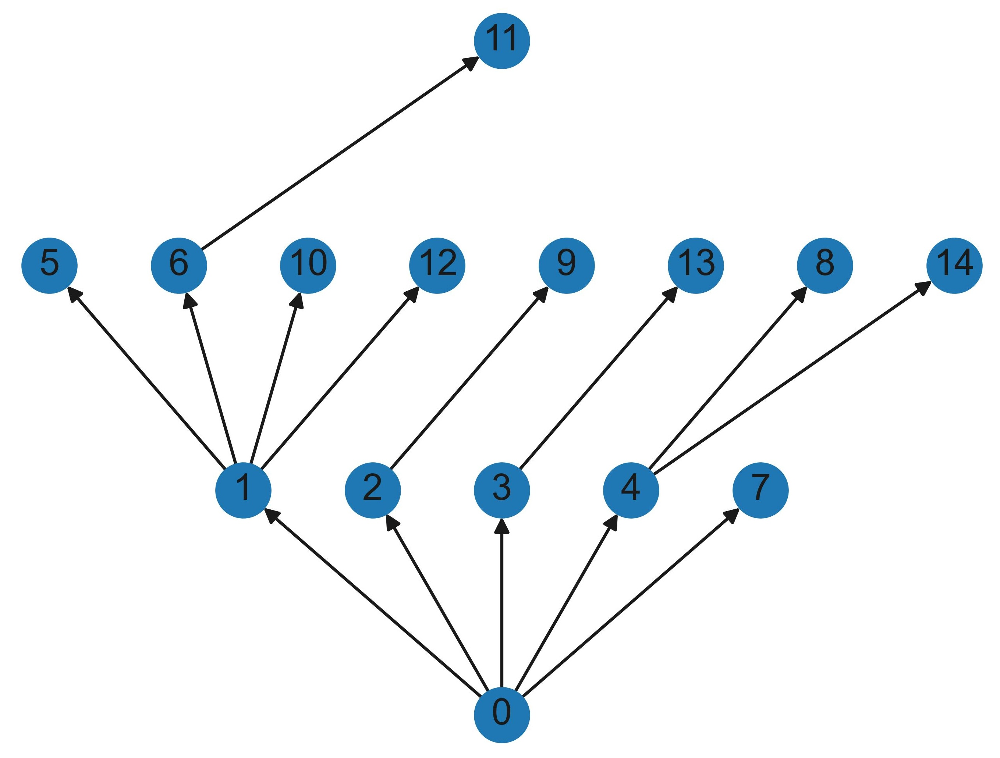
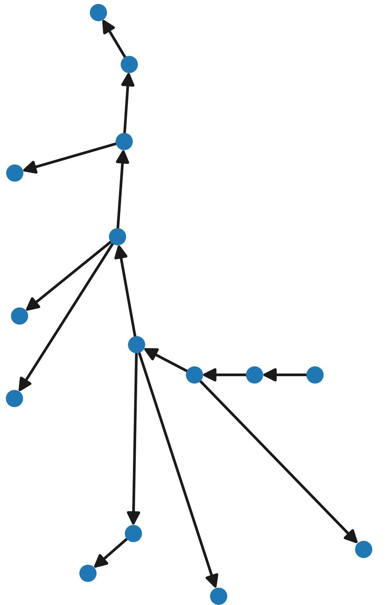
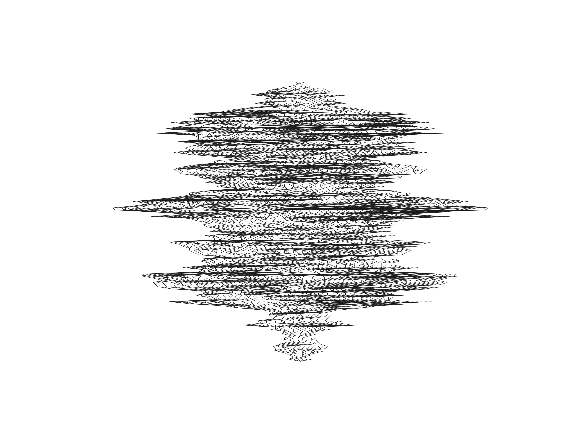
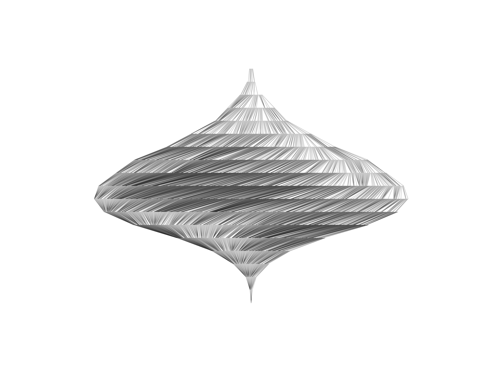
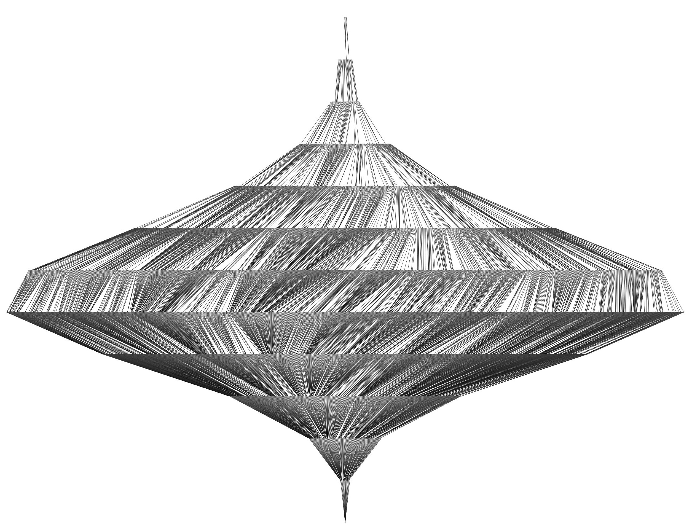

# trees
Python code for the generation of random rooted and recursive trees.


# Installation

```bash
git clone https://github.com/darkxan771/trees.git
```

From outside the trees repository, one can launch `jupyter lab`, 
then create a Python notebook and execute in the first cell 
```python
from trees import *
```


# Features
The following important classes are implemented:

- RecursiveTrees
- RecursiveTree

```python
T = RecursiveTree(max_size=15)
for i in (0, 0, 0, 0, 1, 1, 0, 4, 2, 1, 6, 1, 3, 4):
	T.add_node(i)
T.plot()
```


- RootedTrees
- RootedTree

```python
T = RootedTrees(15).from_nested_list([[[[[[[[]], []], [], []], [[]], []], []]]])
T.plot(style="circular", node_size=30)
```


- UniformRootedTree

```python
UniformRootedTree(5000).get_random_element(exact=False).plot(node_size=0, width=0.25, arrows=False)
```


- UniformRecursiveTree

```python
UniformRecursiveTree(5000).get_random_element().plot(node_size=0, width=0.1, arrows=False, labels="empty")
```


- PlancherelRecursiveTree

```python
PlancherelRecursiveTree(5000).get_random_element().plot(node_size=0, width=0.1, arrows=False, labels="empty")
```

