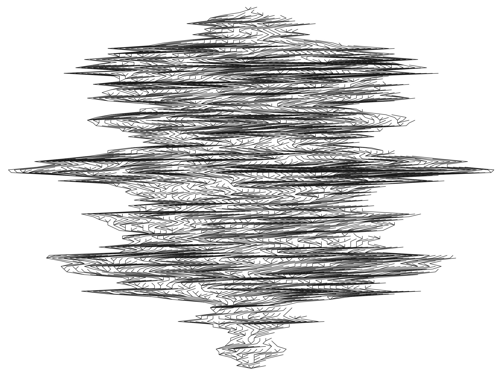
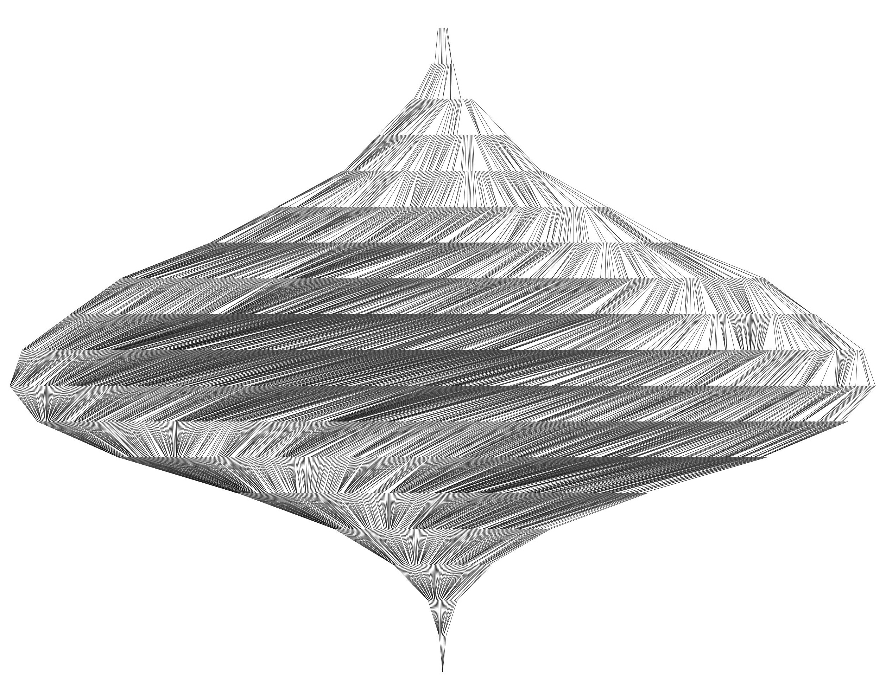

# trees
Python code for the generation of random rooted and recursive trees.

# Installation

```bash
git clone https://github.com/darkxan771/trees.git
```

In the jupyter/ folder, one can launch `jupyter lab`, 
then create a Python notebook and execute in the first cell: 
```python
import sys
sys.path.insert(0, "../src/")
from eternitree import *
```


# Features and usage
For now, one can manipulate rooted unlabelled or rooted recursive trees,
create large random trees, obtain them by a Crump-Jagers-Mode branching
process, and plot them with many options. The user can test the many methods
of the objects described below.

The following important classes are implemented:

- RecursiveTrees
- RecursiveTree

```python
T = RecursiveTree()
for i in (0, 0, 0, 0, 1, 1, 0, 4, 2, 1, 6, 1, 3, 4):
	T.add_node(i)
T.plot()
```


- RootedTrees
- RootedTree

```python
T = RootedTrees().from_nested_list([[[[[[[[]], []], [], []], [[]], []], []]]])
T.plot(style="circular", node_size=30)
```


- UniformRootedTree

```python
UniformRootedTree(5000).get_random_element(exact=False).plot(large=True, width=0.25)
```


- UniformRecursiveTree

```python
UniformRecursiveTree(5000).get_random_element().plot(large=True, width=0.1)
```


- PlancherelRecursiveTree

```python
PlancherelRecursiveTree(5000).get_random_element().plot(large=True, width=0.1)
```

